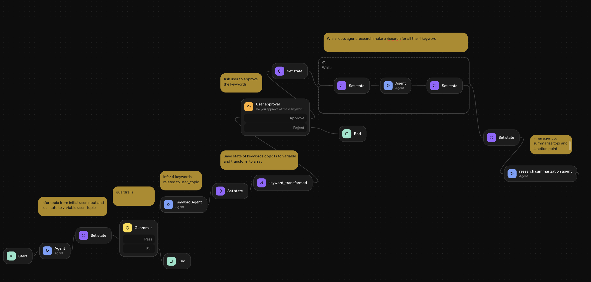
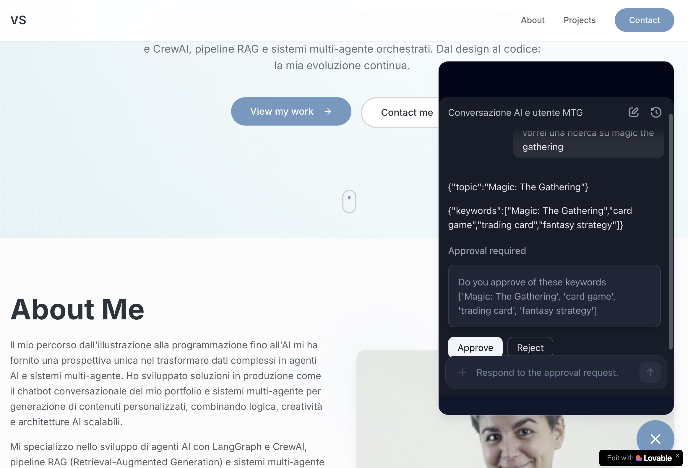

# ChatKit Starter Template - AWS & Vercel Edition

[](LICENSE)


This is an **extended version** of the original [OpenAI ChatKit Starter Template](https://github.com/openai/openai-chatkit-starter-app), enhanced with:

- ✅ **Docker support** for containerized deployments
- ✅ **AWS App Runner** deployment guide with full troubleshooting
- ✅ **Multi-platform build** support (ARM64/AMD64)
- ✅ **Production-ready** configuration for Vercel and AWS
- ✅ **Easy integration** as a chatbot widget in other apps (Lovable, React, etc.)

This repository is the simplest way to bootstrap a [ChatKit](http://openai.github.io/chatkit-js/) application. It ships with a minimal Next.js UI, the ChatKit web component, and a ready-to-use session endpoint so you can experiment with OpenAI-hosted workflows built using [Agent Builder](https://platform.openai.com/agent-builder).

## About This Project

This extended version was developed during the [OpenAI Agent Builder course](https://www.udemy.com/course/openai-agent-builder/) by Diogo Alves de Resende. The course project involved building a **Deep Research Agent** with multi-agent orchestration:



**Agent Workflow:**
1. Topic extraction from user input
2. Guardrails validation
3. Keyword generation (4 strategic keywords)
4. User approval
5. While loop for deep research on each keyword
6. Final summarization

**The Challenge**: The course didn't cover how to integrate ChatKit as a widget in external applications. I solved this by adding Docker containerization, AWS deployment, and a reusable React widget component.

**Known Issues in Agent Builder** (as of course completion):
- 🐛 Variable selection in dropdown menus sometimes selects wrong variables
- 🐛 Web Search tool conflicts with MCP Google Calendar - remove Web Search if using Calendar

**Live Demo**: [minimal-persona-showcase.lovable.app](https://minimal-persona-showcase.lovable.app/)

## What You Get

- Next.js app with `<openai-chatkit>` web component and theming controls
- API endpoint for creating a session at [`app/api/create-session/route.ts`](app/api/create-session/route.ts)
- Config file for starter prompts, theme, placeholder text, and greeting message

## Getting Started

### 1. Install dependencies

```bash
npm install
```

### 2. Create your environment file

Copy the example file and fill in the required values:

```bash
cp .env.example .env.local
```

You can get your workflow id from the [Agent Builder](https://platform.openai.com/agent-builder) interface, after clicking "Publish":


You can get your OpenAI API key from the [OpenAI API Keys](https://platform.openai.com/api-keys) page.

### 3. Configure ChatKit credentials

Update `.env.local` with the variables that match your setup.

- `OPENAI_API_KEY` — This must be an API key created **within the same org & project as your Agent Builder**. If you already have a different `OPENAI_API_KEY` env variable set in your terminal session, that one will take precedence over the key in `.env.local` one (this is how a Next.js app works). So, **please run `unset OPENAI_API_KEY` (`set OPENAI_API_KEY=` for Windows OS) beforehand**.
- `NEXT_PUBLIC_CHATKIT_WORKFLOW_ID` — This is the ID of the workflow you created in [Agent Builder](https://platform.openai.com/agent-builder), which starts with `wf_...`
- (optional) `CHATKIT_API_BASE` - This is a customizable base URL for the ChatKit API endpoint

> Note: if your workflow is using a model requiring organization verification, such as GPT-5, make sure you verify your organization first. Visit your [organization settings](https://platform.openai.com/settings/organization/general) and click on "Verify Organization".

### 4. Run the app

```bash
npm run dev
```

Visit `http://localhost:3000` and start chatting. Use the prompts on the start screen to verify your workflow connection, then customize the UI or prompt list in [`lib/config.ts`](lib/config.ts) and [`components/ChatKitPanel.tsx`](components/ChatKitPanel.tsx).

### 5. Deploy your app

You have multiple deployment options:

#### Deploy to Vercel (Easiest)

```bash
npm run build
```

Before deploying, add your deployment domain to the [Domain allowlist](https://platform.openai.com/settings/organization/security/domain-allowlist) on your OpenAI dashboard.

#### Deploy to AWS App Runner with Docker

For a comprehensive guide on deploying with Docker to AWS App Runner (including ECR setup, health check configuration, and troubleshooting), see [AWS_DEPLOYMENT.md](./AWS_DEPLOYMENT.md).

**Quick Docker setup:**

```bash
# 1. Build the Docker image (Mac M-series users: use --platform linux/amd64)
docker buildx build \
  --platform linux/amd64 \
  --build-arg NEXT_PUBLIC_CHATKIT_WORKFLOW_ID="wf_..." \
  -t chatkit-app:latest \
  --load \
  .

# 2. Test locally
docker run -p 3000:3000 \
  -e OPENAI_API_KEY="sk-proj-..." \
  -e NEXT_PUBLIC_CHATKIT_WORKFLOW_ID="wf_..." \
  chatkit-app

# Or use docker-compose
docker-compose up
```

**Important notes:**
- On Mac M1/M2/M3, always use `--platform linux/amd64` for AWS compatibility
- Each user must provide their own `NEXT_PUBLIC_CHATKIT_WORKFLOW_ID` via `--build-arg`
- See [AWS_DEPLOYMENT.md](./AWS_DEPLOYMENT.md) for complete AWS deployment instructions

### Adding Your Domain to OpenAI Allowlist

**IMPORTANT**: Before your deployed app can work, you MUST add your deployment domain to the OpenAI Domain Allowlist.

1. **Get your deployment URL**:
   - **Vercel**: `your-app-name.vercel.app`
   - **AWS App Runner**: `xxxxxxxx.eu-west-1.awsapprunner.com`
   - **Custom domain**: `chat.yourdomain.com`

2. **Add to OpenAI Allowlist**:
   - Go to [OpenAI Domain Allowlist](https://platform.openai.com/settings/organization/security/domain-allowlist)
   - Click "Add domain"
   - Enter your domain (without `https://`, just the domain part)
   - Save

3. **Wait a few minutes** for the changes to propagate, then test your app

Without this step, ChatKit will fail to load with CORS errors.

## Integration as Chatbot Widget

Once deployed, you can easily integrate this chatbot as a floating widget in any React application (Lovable, Next.js, Vite, etc.).

### Example Widget Component

Create a `ChatbotWidget.tsx` component in your frontend app:

```tsx
import { useState } from "react";
import { MessageCircle, X } from "lucide-react";

interface ChatbotWidgetProps {
  chatbotUrl?: string;
}

const ChatbotWidget = ({
  chatbotUrl = "https://your-chatbot.vercel.app"
}: ChatbotWidgetProps) => {
  const [isOpen, setIsOpen] = useState(false);

  const toggleChatbot = () => {
    setIsOpen(!isOpen);
  };

  return (
    <>
      {/* Chatbot Iframe */}
      <div
        className={`fixed bottom-24 right-4 md:right-6 w-[calc(100vw-2rem)] md:w-[400px] h-[500px] md:h-[600px] bg-background border border-border rounded-2xl shadow-lg z-[998] transition-all duration-300 ${
          isOpen
            ? "opacity-100 scale-100 pointer-events-auto"
            : "opacity-0 scale-95 pointer-events-none"
        }`}
      >
        <iframe
          src={chatbotUrl}
          className="w-full h-full rounded-2xl"
          title="Chatbot"
          allow="microphone"
        />
      </div>

      {/* Floating Button */}
      <button
        onClick={toggleChatbot}
        className={`fixed bottom-4 md:bottom-6 right-4 md:right-6 w-14 h-14 md:w-16 md:h-16 bg-primary hover:bg-primary/90 text-primary-foreground rounded-full flex items-center justify-center shadow-lg z-[999] transition-all duration-300 hover:scale-110 active:scale-95`}
        aria-label={isOpen ? "Close chatbot" : "Open chatbot"}
      >
        {isOpen ? (
          <X className="h-6 w-6 md:h-7 md:w-7" />
        ) : (
          <MessageCircle className="h-6 w-6 md:h-7 md:w-7" />
        )}
      </button>
    </>
  );
};

export default ChatbotWidget;
```

### Usage in Your App

```tsx
import ChatbotWidget from "@/components/ChatbotWidget";

function App() {
  return (
    <div>
      {/* Your app content */}
      <ChatbotWidget chatbotUrl="https://your-deployed-chatbot.vercel.app" />
    </div>
  );
}
```

### Quick Test on Lovable

1. Deploy this ChatKit app to Vercel or AWS
2. Add the domain to OpenAI allowlist
3. Create the `ChatbotWidget` component in your Lovable project
4. Pass your deployment URL as the `chatbotUrl` prop
5. The chatbot will appear as a floating button in the bottom-right corner

**Live Demo**: See the widget in action at [minimal-persona-showcase.lovable.app](https://minimal-persona-showcase.lovable.app/)



## Customization Tips

- Adjust starter prompts, greeting text, [chatkit theme](https://chatkit.studio/playground), and placeholder copy in [`lib/config.ts`](lib/config.ts).
- Update the event handlers inside [`components/ChatKitPanel.tsx`](components/ChatKitPanel.tsx) to integrate with your product analytics or storage.

## References

- [ChatKit JavaScript Library](http://openai.github.io/chatkit-js/)
- [Advanced Self-Hosting Examples](https://github.com/openai/openai-chatkit-advanced-samples)
- [Original OpenAI Starter Template](https://github.com/openai/openai-chatkit-starter-app)
